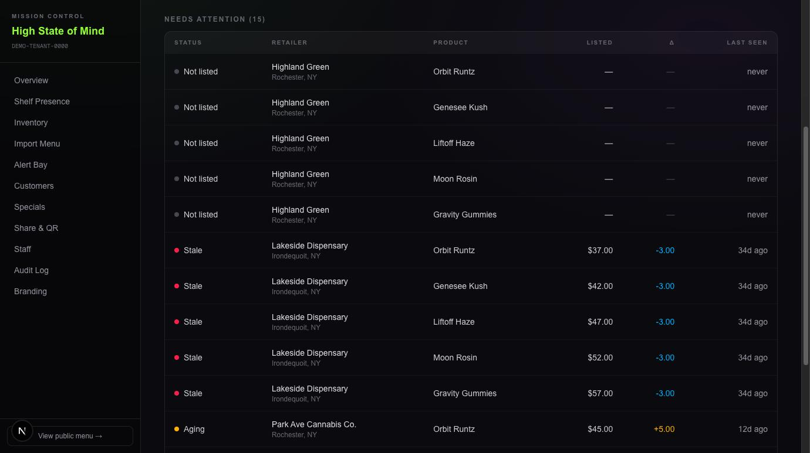
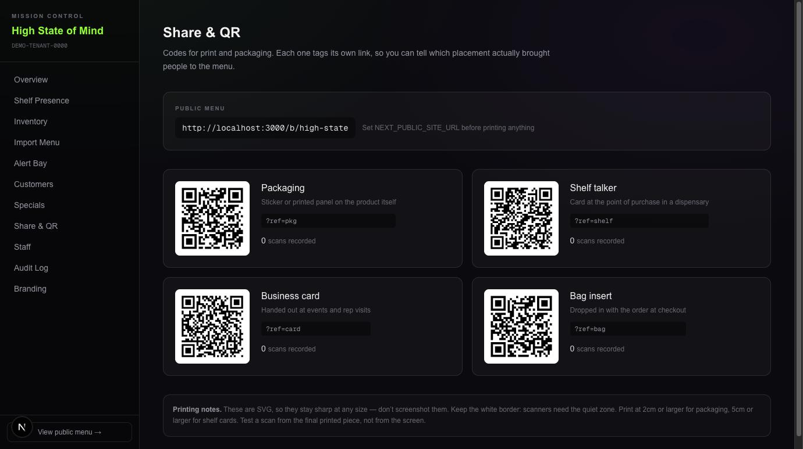

# Shelf OS

Compliant product presence for regulated brands that can't advertise.

Cannabis, hemp, and nicotine brands are banned from Google and Meta ads,
dropped by most payment processors, and largely ignored by mainstream
SaaS. They still need somewhere to publish accurate product information,
prove lab results, and tell a customer where to actually buy the thing.

Shelf OS is that surface. **It deliberately does not sell anything** — no
cart, no checkout, no payment rails. Skipping transactions avoids payment
processing, seed-to-sale integration, and the compliance weight that comes
with commerce, which is what makes it deployable for a brand in weeks
rather than quarters.

---

## What it looks like

**Public menu** — brand-themed, age-gated, per-batch COA links.


**Shelf presence** — every store × every product, worst first. A product a
store carries but has never listed shows as *Not listed* rather than being
absent from the table, which is the case that actually costs a brand money.
The delta column compares each store's price against the median observed
across stores.



**Share & QR** — a code per print placement, each tagging its own `?ref`,
so a brand that cannot buy ads can still tell which physical placement
worked.



---

## Why it's built this way

**Nothing in the data model is cannabis-specific.** A `Brand` carries a
`vertical` (cannabis, hemp, nicotine, other) and its own `minimumAge`.
Vertical behaviour lives in configuration, not in the schema, so the same
codebase serves a hemp beverage brand or a nicotine brand without a fork.

**COA links must never break.** `Batch` and `LabResult` are additive. When
a new certificate supersedes an old one the previous row is retained and
only `isCurrent` moves. The QR code is already printed on packaging
sitting on a shelf somewhere — a dead link on a compliance document is a
real problem, not a cosmetic one.

**Regulations are data, not code.** `ComplianceRule` stores state
requirements versioned by `effectiveFrom` / `effectiveTo`, so a label or
filing can be evaluated against the rules in force at a point in time
rather than only against today's. Rules carry a `citationUrl` back to the
regulator.

**Listing staleness is a first-class signal.** `RetailerListing.observedAt`
records when a listing was last confirmed. Brands currently answer *"which
of the stores carrying us have our current price and COA live?"* by
checking dispensary menus by hand, store by store, or not at all. The data
to answer it automatically is modelled here.

---

## Data model

```
Brand ─┬─ Product ── ProductVariant ── Batch ── LabResult
       │                                          (COA, additive)
       ├─ BrandRetailer ── Retailer ── RetailerListing
       │                                 (observedAt -> staleness)
       └─ ComplianceRule
            (rules-as-data, versioned by effective date)
```

| Model | Purpose |
|---|---|
| `Brand` | Tenant. Every query is scoped by `brandId` |
| `Product` / `ProductVariant` | Catalog. Potency lives on the variant — a 1g and a 3.5g differ |
| `Batch` | Manufactured lot. What a package QR resolves to |
| `LabResult` | COA. Additive so superseded certificates keep resolving |
| `ComplianceRule` | State requirements as versioned data |
| `Retailer` / `BrandRetailer` | Where the brand is stocked |
| `RetailerListing` | A product seen at a store, with a last-observed timestamp |

---

## Stack

Next.js 16 (App Router) · TypeScript · Tailwind CSS 4 ·
Prisma 7 · PostgreSQL 17

---

## Running locally

Requires Node 20+, pnpm, and Docker.

```bash
pnpm install
docker compose up -d                    # Postgres on :55440
cp .env.example .env                    # set MC_PASSWORD before /mc/* opens
pnpm prisma migrate dev
pnpm prisma generate
pnpm tsx prisma/seed.ts                 # demo brand + catalog
pnpm dev
```

Then open **http://localhost:3000/b/north-shore**, or run

```bash
pnpm tsx scripts/seed-high-state.ts    # second tenant, with retailers
```

for a fuller tenant at **/b/high-state** and **/mc/high-state** — five
products across four retailers, seeded to exercise every shelf-presence
state (current, aging, stale, and carried-but-never-listed) and a price
spread that triggers the mismatch flag.

Retailer names in both seeds are fictional.

The seed creates a fictional brand with three products, four batches with
current COAs, and three retailers — one deliberately seeded with a 45-day
stale listing so the staleness logic has something to show.

---

## Status

Working today — 12 routes, all rendering against real data:

**Public**
- [x] Brand-themed menu: categories, variants, potency, per-batch COA links
- [x] Age gate (self-attestation, session-scoped, no tracking)
- [x] Where-to-buy locator
- [x] Link previews with per-tenant share images

**Mission Control** (`/mc/[slug]`)
- [x] Overview
- [x] Shelf presence — freshness + price-delta across retailers
- [x] Inventory editing (server actions, transactional audit)
- [x] Chat menu import — paste a messy inventory message, preview, confirm
- [x] Alert Bay — segments and sends, gated behind approval
- [x] Customers — per-channel consent with source and timestamp
- [x] Specials — state-scoped promotions
- [x] Share & QR — per-placement codes with scan attribution
- [x] Staff and roles
- [x] Audit log — append-only
- [x] Branding — asset slots on a transparency checkerboard
- [x] Shared-password gate over all of `/mc/*` (signed httpOnly cookie,
      12h expiry, fails closed when `MC_PASSWORD` is unset)

**Not built yet**
- [ ] **Per-user login.** The gate is one shared password. Audit events
      are attributed to a `StaffUser`, and with a shared password that
      attribution is an assumption, not a fact. This must be replaced
      with per-user sign-in before a brand puts a second person in here.
- [ ] Automated retailer listing ingestion — listings are entered by hand
- [ ] Compliance checker reading `ComplianceRule`
- [ ] Actual alert delivery (SMS/email providers are not wired)

---

## A note on the age gate

The gate is **self-attestation**, the common standard for informational
brand sites. It is not identity verification — that's a separate
requirement that applies to transactions, and this project doesn't
transact. The visitor's answer is stored in `sessionStorage` only: nothing
is sent to the server and no identifier is created.

**Nothing in this repository is legal advice.** Cannabis and nicotine
marketing rules vary by state and change often. Any brand deploying this
should have its own counsel confirm what applies to it.

---

## License

MIT
